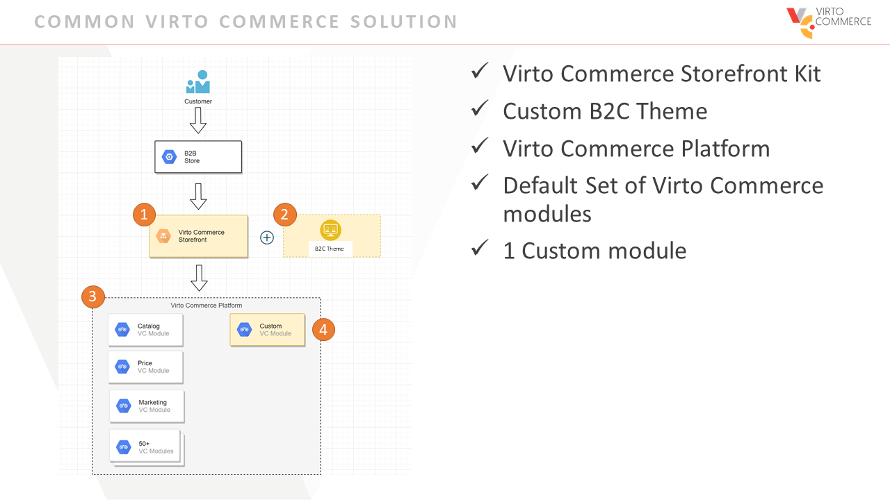
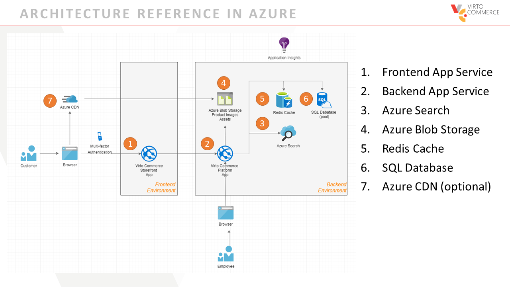
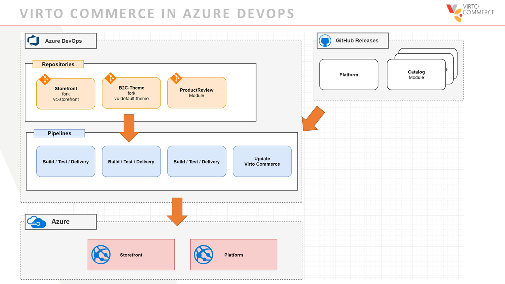
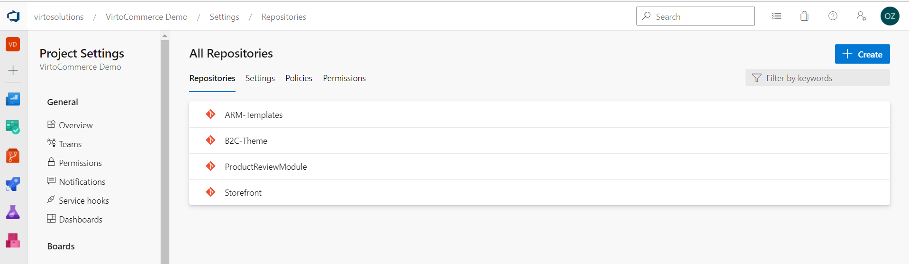
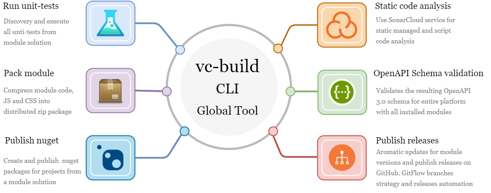

# How to use Azure DevOps for Virto Commerce solutions

During this webinar, we will go through the first steps to demonstrate how to use Azure DevOps to build the Virto Commerce solution throughout application planning, development, delivery, and operations. You will learn how to apply the right combination of DevOps technologies, culture, and processes to enable continual software delivery and better value for the customers.

This webinar’s content is primarily technical-oriented; therefore, we invite everyone interested in developing software for ecommerce solutions using Microsoft technologies.

## Section 1 - What's Virto Commerce solution in Azure

### Common Virto Commerce Solution

### Architecture Reference in Azure

### Virto Commerce in Azure devops

### Repositories

## Section 2 - Productivity & Quality tools

### vc-build 

### Links

[vc-build docs](https://github.com/VirtoCommerce/vc-platform/tree/master/build)

[VC GitActions workflow examples](https://github.com/VirtoCommerce/vc-platform/blob/master/.github/workflows/main.yml)

[virtocommerce sonarcloud](https://sonarcloud.io/organizations/virto-commerce/projects)

## Section 3 - How to Configure pipelines
TODO:
