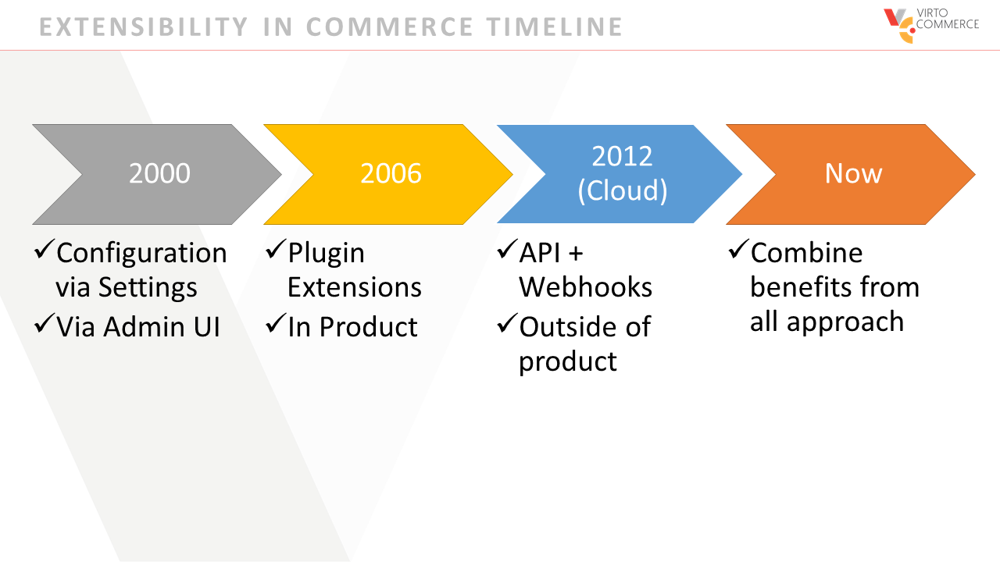
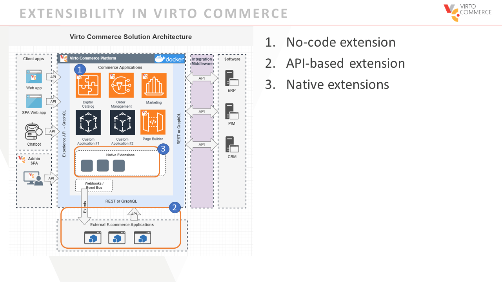
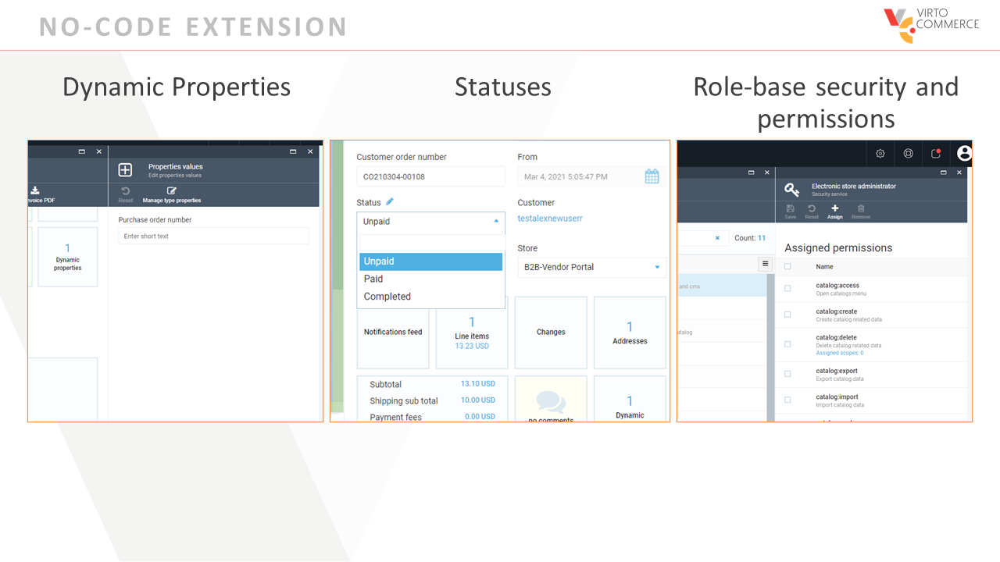
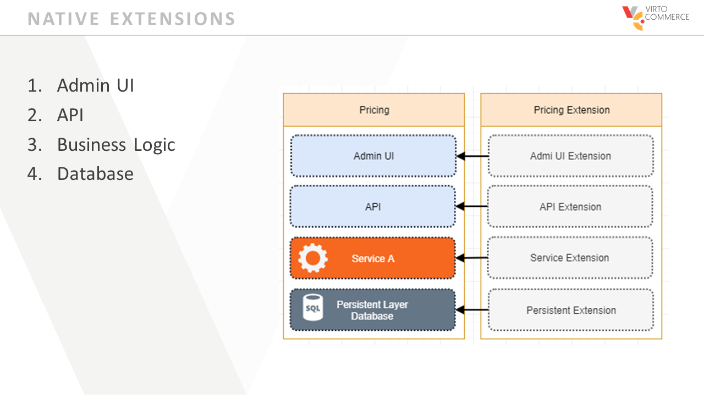
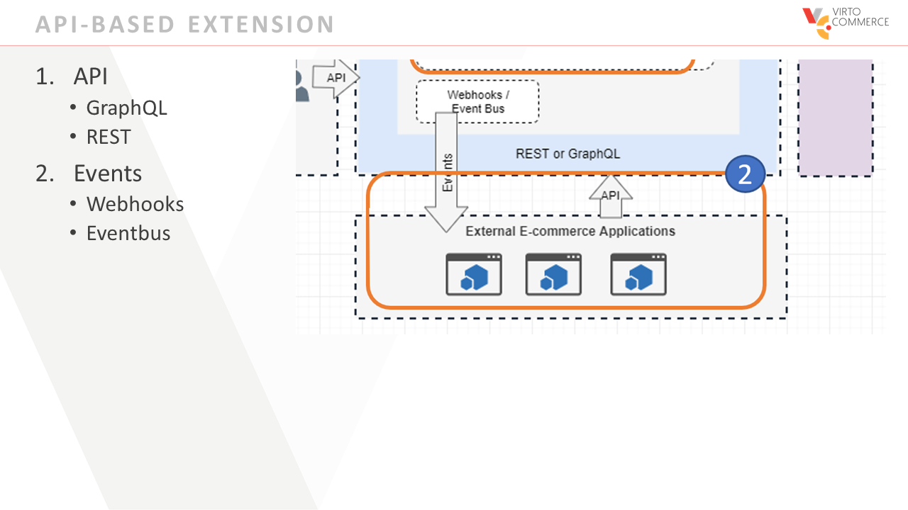
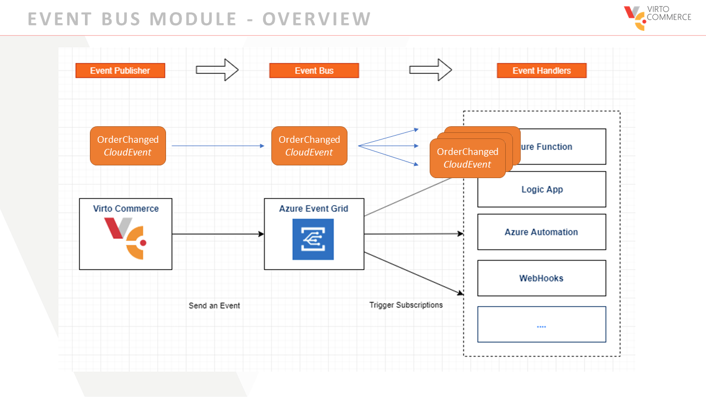
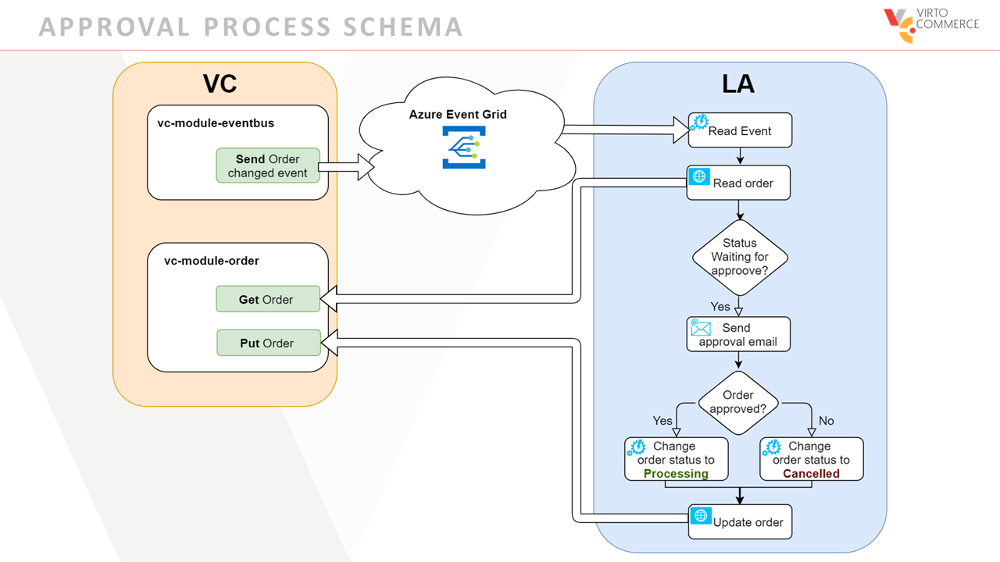
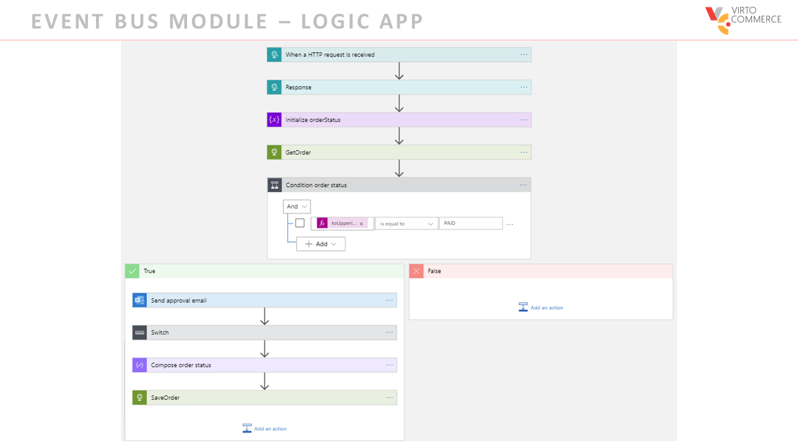

# Virto Commerce extensibility withEvent Bus

We are pleased to invite you to our next webinar, where we reveal the features of the new module in the Virto Commerce platform: Event Bus.  

The Virto Commerce Event Bus module allows you to be notified of new messages or changes via a Message Queue of your choice. That makes event-driven, reactive programming possible, and it uses a publish-subscribe model.  Publishers emit events but have no expectations about which events are handled, and subscribers decide which events to handle. 

This webinar demonstrates how to properly configure and use it with Logic App to build and customize the order approval process. 

The content of the webinar is primarily technology-oriented. We especially invite solution architects and developers to attend this webinar. 

During the webinar, the emphasis will be on the Event Bus module demo.  

Key topics include: 

1. Overview of Virto Commerce extensibility  
1. Event Bus module overview  
1. How to configure Event Bus with Azure Event Grid  
1. How to build Approval Workflow with Event Bus, Azure Event Grid and Logic App  
1. Questions and answers 
1. For Event Bus module documentation, please visit our website.

## Overview of Virto Commerce extensibility
Virto Commerce implements a lot of functionality. From my point of view, readiness of the product is very high. But we understand every business is unique and extensibility of the platform is key point. 

If we look at the history of ecommerce solutions, you can see that.

First, the Extensibility of Ecommerce products started with configuration via setting and admin UI. All customization were prepared by the vendor. But it means the vendor should understand every business-specific. And if you need a new feature for your solution, you will need to wait for a new release.

Second, Ecommerce products supported extensibility with plugins. The vendor allowed to do the injection in a specific place, so a developer can implement custom business logic by himself. It decreases development effort for a custom solution, you can implement your business needs, but was limited and errors in the current pipeline can crash the solution.

With cloud and SaaS products, the extensibility approach was changed to integration on API and Webhook level. To keep updatability and control resources, the Vendor doesn’t allow to install the extension into the product. A developer can create a custom product close to the original and do the integration. It means you need to create all DevOps routine for an extension. 

In Virto Commerce, we are trying to use benefits and experience from all this approach.

Unlimited extensibility is an advantage of Virto Commerce. This means end-user solution developers can adapt or replace Virto Commerce modules with their own functionality. This adaptation   can be done in an elegant and simple way without workarounds.  

There are three types of vendor-made extensions that guarantee the “seamless delivery”.  Virto guarantee these ways of extensibility would be enough to build a ecommerce solution of any complexity on top of it.  
 
1. No-code extensions. 
2. API-based extensions. 
3. Native extensions. 

### No-code extensions

No-code extensions. Virto Commerce supports declarative extensions through the Admin interface and API to extend the data model, UI, and workflow processing.  

Virto Commerce supports:
* Dynamic properties
* Statuses
* Role-base security and permissions

### Native extensions

This is an advanced mode of modular extensions. It is called native because it is a way how Virto Commerce is built internally. 

Virto Commerce creates a unique extension framework based on .NET extension and dependency injection. It allow to extend default implementation for the unique needs of each business. Plus, it simplifies DevOps procedures and provides performance.  Source-code is available only for purpose of transparency. Virto diesn’t recommend to extend the plafrom through source-code. it will  breach the continuos delivery functionality. 

### API-based extensions

These are traditional cloud-based extensions based on API calls and Events (Hooks). Developers can use any language and framework for integration and reactive programming. 

## Event Bus Module + Azure Event GRID
It uses a publish-subscribe model. 

Virto Commerce emit events but have no expectation about which events are handled. Subscribers decide which events they want to handle.

The module allows you to send event, for example Order Created to event provider and them to endpoints, and consume them with custom code. It enables near real-time delivery (typically less than one second) at scale (thousands of events per second).

[Read Documentation](https://virtocommerce.com/docs/latest/modules/event-bus/)

## DEMO: How to USE Event Bus

### Approval Process Schema

Azure Logic Apps is a cloud service that helps you design and build scalable solutions for app integration. Logic Apps help you connect different systems more easily and quickly by providing prebuilt APIs as Microsoft-managed connectors. That way, you can focus on your apps' business logic and functionality.

When order changed event module sent event to Azure Event Grid (the structure of the event body e will review later)

Logic App subscribes to Azure event Grid topic and listens for the new events. When the new event accrue, Logic App read order,  checks the order status, if status paid (that means tnat the new order created) send approval email and waited for approve response

If response approve order, LA change order status to Processing
If order rejected  LA change status to Cancelled 

Then LogicApp update order in Cirtocommerce.
 
Let me  implement this logic with event bus module and Logic app  

### Sample

[Microsoft Logic Apps application to show how to subscribe to Event Grid Topic.](VcEventbusModuleSample/readme.md)

