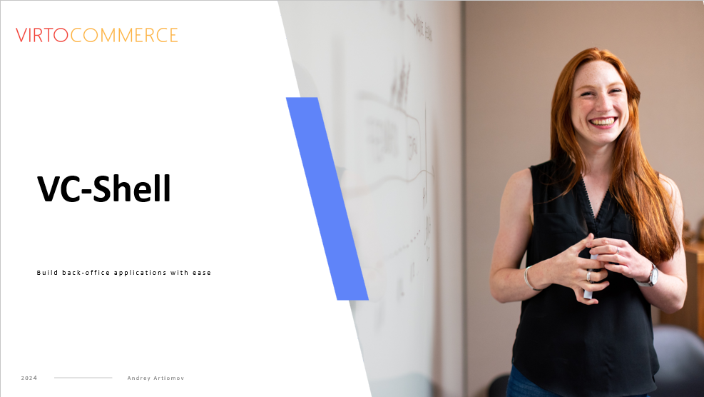
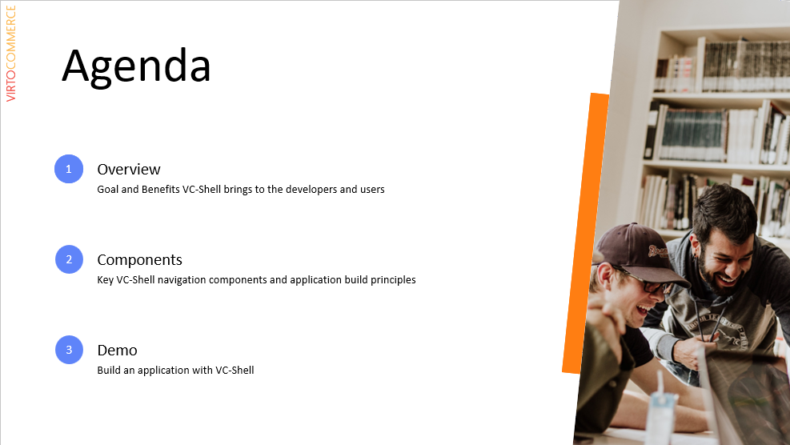
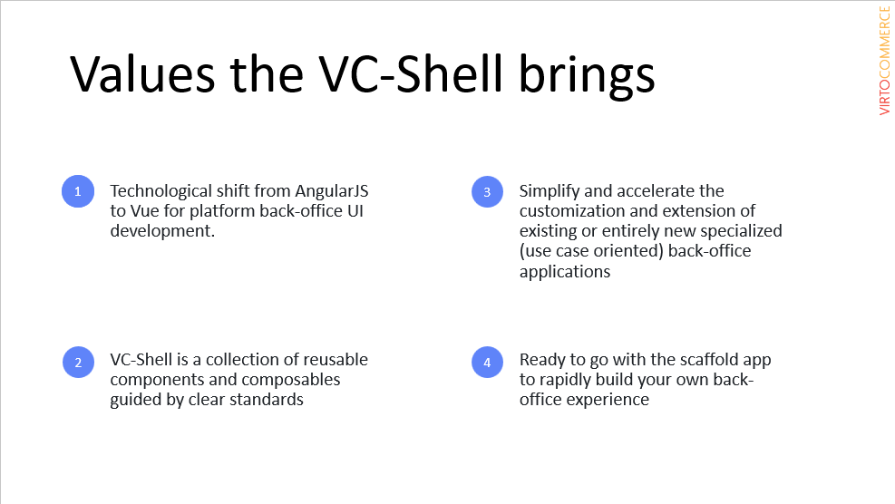
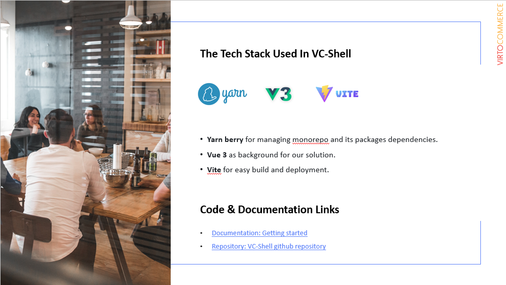
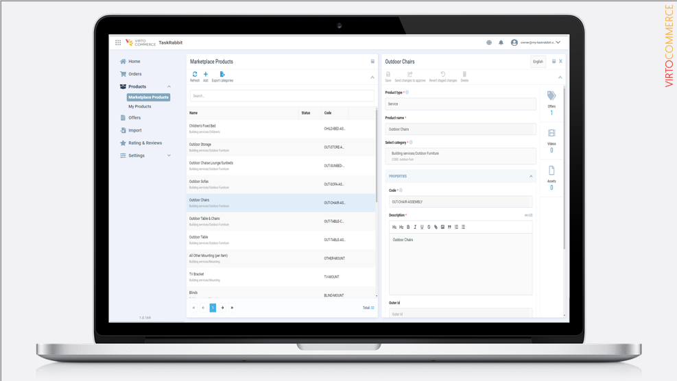
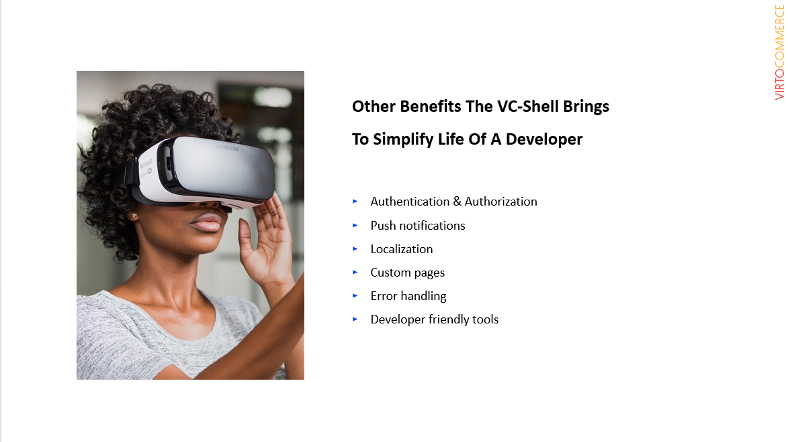
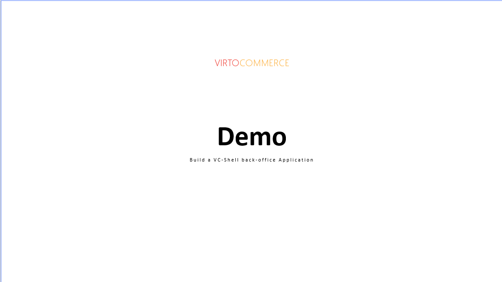

# How to Create a New Back Office App via Virto Shell

We will review Virto Shell for you and share its key components. We will also demo how to build a working application from a VC-Shell scaffolding app!

Key topics include: 
1. Overview
2. Components
3. Live Demo

[Download Presentation](<VC-Shell webinar.pdf>)

## Build back-office applications with VC-Shell
Hi everyone,
Thanks for joining our webinar.
Let me share with you the background of what is VC-Shell and why we decided to create it and share with our partners. 
What is VC-Shell? In short it’s a collection of components and practices to easily build and extend back-office applications.
And answering to the “why?” question is a bit longer. While building back-office user interfaces for our internal and client projects we find that our current back-end based on AngularJS becomes outdated and not that flexible to customize and extend. It’s still good and actively used to build back-office interfaces. We support and bring new functionality with it.
Besides, VirtoCommerce current back-end is not completely mobile responsive. And more and more people want to have their working tool available by their hand. They expect to monitor and manage as much as possible from anywhere using their mobile devices.
All the above reasons brought us to the idea to build Virto Marketplace Vendor portal using new technological stack.
From the very beginning of building a Vendor portal we decided to make it re-usable and extendable. In the products and projects, we and our partners build we see, that most of the back-office tasks and UI interfaces has many common things that can be re-used, customized or extended. So, we tried to take the commonality and create a building blocks for creating back-office user experiences.
Eventually, it developed into a separate activity within Virto with its own team, repository, documentation and we gave it the VC-Shell name.

With this short intro I hope everyone has joined and we can start.
Just let me remind you that the webinar is being recorded and link to the recording will be shared with everyone registered to it. I also expect it will be published later in our YouTube channel.

what should you expect in the next 30-35 minutes?

* First, I will briefly overview the goal and benefits the VC-Shell brings to dev teams and end users.

* Next, I will cover VC-Shell key components and principles.

* And, in the biggest and main part we will deploy and launch VC-Shell scaffolding app. And use it to build a real example of a working back-office application that will utilize real VirtoCommerce REST API endpoints.

Let’s begin and do the first touch to a VC-Shell world.

## Values the VC-Shell brings

Let me briefly overview main benefits Virto-Shell brings to developer teams:
First, it’s a technological shift from AngularJS to Vue for building back-office user experiences.
1. VC-Shell makes a shift to Vue that brings much more options to build modern UX/UIs. To achieve development standardization and reduce the entry threshold to start building back-office business applications.
Next, VC-Shell is a collection of reusable components, guided by clear standards and extensive documentation
2. Increase your development team performance implementing a custom back-office applications by reusing provided out-of-box well documented components. We will share the links to the documentation in the end of the webinar and later in the follow-up e-mail.
It also, allows to simplify and accelerate the customization and extension of existing or building entirely new specialized back-office applications
3. Re-use, customize and extend existing back-office applications, such as Vendor portal, Task app, Import app
And last but not least, VC-shell provides a ready to go scaffolding application to start building your own back-office experience rapidly.
4. It allows building a back-office application not from scratch but having a good starting point. During the demo I will rely on the scaffolding application while building the orders management app. And that is a recommended way to start developing apps with VC-Shell.

## The technological stack

On the next slide you can see the pre-requisites and a technological stack used to develop VC-Shell and build apps based on it.
The list is not long. These are 
* Yarn berry for managing mono-repo and its packages dependencies.
* Vue 3 as a background for our solution.
* Vite for easy build and deployment.

## Main principles and components of the application built on VC-Shell

Now, let's highlight the main principles and components of the application built on VC-Shell
### Navigation system
* Navigation in VC-Shell apps is similar to the Virto back-end apps navigation.
1. That is a horizontal Header on top, which has an application switch block to switch between business applications, Organization logo and name, a language switch control, push notifications bell, and manage account block with a menu to change password and logout that could be extended with additional items. Header can be customized with additional buttons, components etc.
2. A main menu on the left to navigate through the functionalities of the application. It supports two level menus. Menu item order can be customized.
3. Blades system to build main application functionality. Blades takes the biggest part of the working area of the application. There are two main types of blades – first is a list type to show, search and navigate through the lists of entities. And the second type is to display details of the entity to view or edit it. Up to two blades can be displayed at a time. 
4. Each blade has a toolbar with zero to multiple buttons to perform actions with the list elements or an entity. Additional buttons with respective actions can be added and we will do that later in the demo.
5. Each blade has a content area to compose a view of items grid or item details.
6. The list blade grid supports pagination to list through entities pages, search, filters. Each item can have its own actions in the grid (such as delete item, publish, unpublish, confirm, cancel etc).
7. Details blade can have an arbitrary combination of custom and built-in VC-Shell out-of-box components to implement business functionality.
8. Details blade can have zero to many widgets. Widgets can be used as shortcuts to navigate to the related entities or set a customized experience.
* The application has a desktop and mobile layout out-of-box. Part of the components (such as grid) supports an option to build custom mobile templates. All components are mobile ready.

## Other Benefits

This slide shows common principles, practices and features provided by the VC-Shell
### Authentication & Authorization
VC-Shell supports different options to create application with or without login. Single Sign-On login is also supported. VC-Shell applications use authorization cookies, so when a user is logged-in in one app and opens another in the same browser it would not require to login because the authorization cookie is shared.
Every blade and UI component can have its own role-based permissions.
### Push notifications
Push-notifications are built-in to the application. There is a possibility to configure each module to utilize only the defined set of push-notifications.
### Localization
Easy to localize application via localization files. And we will do that during the demo.
### Custom pages
Possibility to add custom pages like dashboards, diagrams, iFrames. All that is possible.
### Error handling
Each blade has its own error handler. There is also an application-level error handler to handle common application errors (for example authorization errors, server errors and more).
### Developer friendly tools
Shared typescript config, api client generator, easy application versioning with embedded release config package, Pre-built Vite config with possibility to customize.

All that is available out-of-box with the scaffolding app

## Demo code, links & documentation

Let’s go to the main part and build a real-life example of a back-office application. In our case it will be a Customer orders application that will connect to a VirtoCommerce platform. Utilize Orders REST API endpoints for the user to be able to list, view, edit, delete customer orders.

Documentation: [Getting started](https://docs.virtocommerce.org/platform/developer-guide/custom-apps-development/vc-shell/Getting-started/creating-first-custom-app/)
Repository: [VC-Shell github repository](https://github.com/VirtoCommerce/vc-shell)
Youtube Webinar recording:

